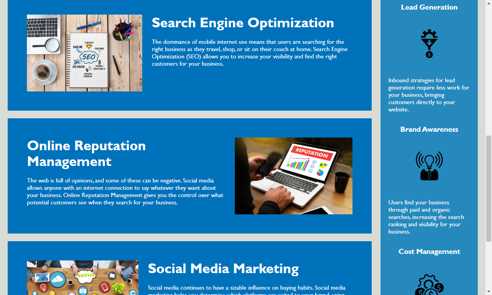
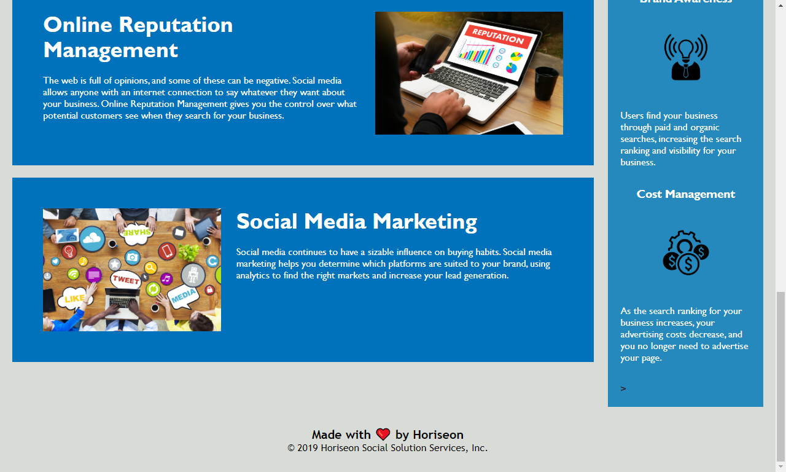

# Applying Semantic formatting

## Description

This repository holds the code for Horiseon's webpage which advertises the web services they offer. This is a more accessible and efficient version than the previous version. I provides easier access for those using Ease of Access capabilities.

## Installation

No installation required. Open as webpage in a web browser.

## Usage

This is a more accessible version that is Ease of Access friendly.

Screen shots of the webpage

Sample screen shot of the code

Sample screen shot of the css

## Credits

I modified pre-existing code based on what I have learned from a Georgia Tech bootcamp.

## License

MIT License

Copyright (c) [2019][horiseon social solution services, inc.]

Permission is hereby granted, free of charge, to any person obtaining a copy
of this software and associated documentation files (the "Software"), to deal
in the Software without restriction, including without limitation the rights
to use, copy, modify, merge, publish, distribute, sublicense, and/or sell
copies of the Software, and to permit persons to whom the Software is
furnished to do so, subject to the following conditions:

The above copyright notice and this permission notice shall be included in all
copies or substantial portions of the Software.

THE SOFTWARE IS PROVIDED "AS IS", WITHOUT WARRANTY OF ANY KIND, EXPRESS OR
IMPLIED, INCLUDING BUT NOT LIMITED TO THE WARRANTIES OF MERCHANTABILITY,
FITNESS FOR A PARTICULAR PURPOSE AND NONINFRINGEMENT. IN NO EVENT SHALL THE
AUTHORS OR COPYRIGHT HOLDERS BE LIABLE FOR ANY CLAIM, DAMAGES OR OTHER
LIABILITY, WHETHER IN AN ACTION OF CONTRACT, TORT OR OTHERWISE, ARISING FROM,
OUT OF OR IN CONNECTION WITH THE SOFTWARE OR THE USE OR OTHER DEALINGS IN THE
SOFTWARE.

## Badges

